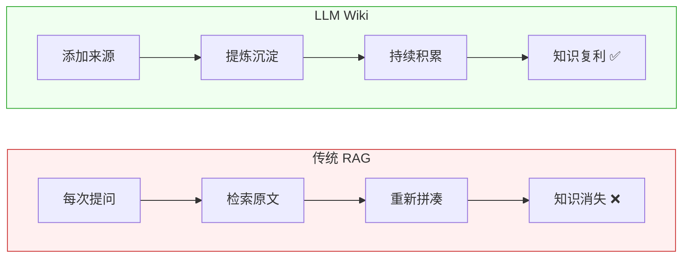

# LLM Wiki in Action

> 用 LLM 构建可复利的个人知识库 —— Andrej Karpathy 的知识管理新范式

## 这是什么

[LLM Wiki](https://gist.github.com/karpathy/442a6bf555914893e9891c11519de94f) 是 Karpathy 提出的一种知识管理模式：**让 LLM 持续构建和维护一个持久的、结构化的 Wiki**，而非传统的 RAG 检索。

核心区别：

## 文档导航

| 文档 | 说明 |
|------|------|
| [核心思想](核心思想.md) | 理念、架构设计、为什么有效 |
| [落地实践](落地方案.md) | 项目结构、Schema 模板、工具链、工作流 |

## 一句话总结

> Obsidian 是 IDE，LLM 是程序员，Wiki 是代码库。
> 你做 Product Manager，策展来源、提出问题；LLM 做所有苦力活。
